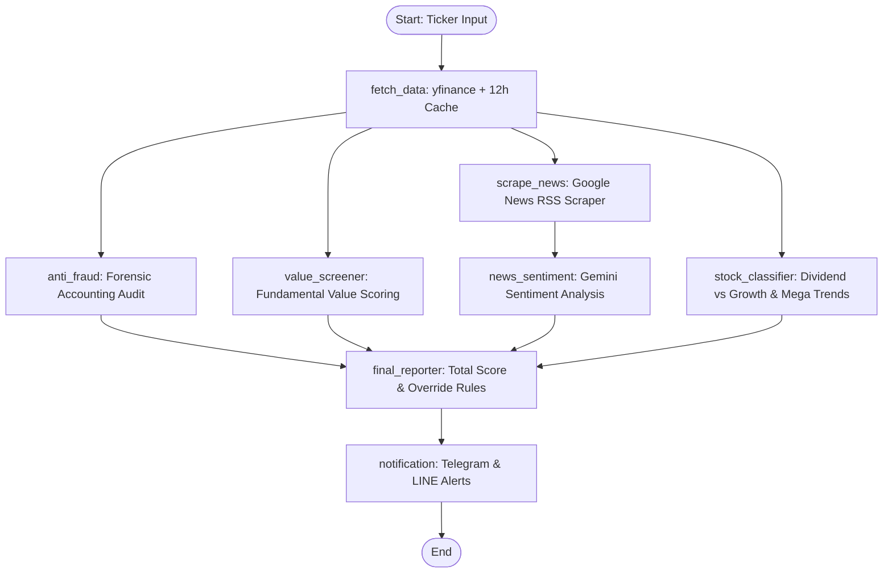
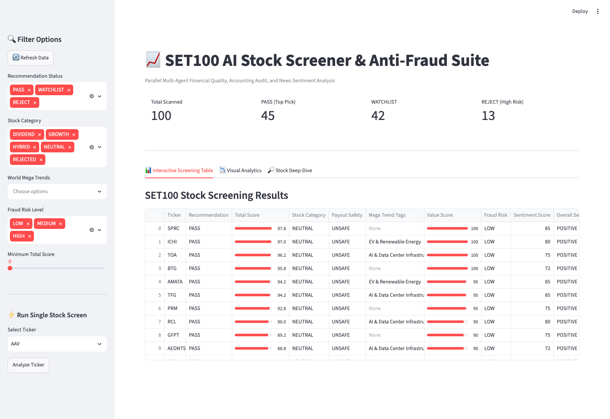
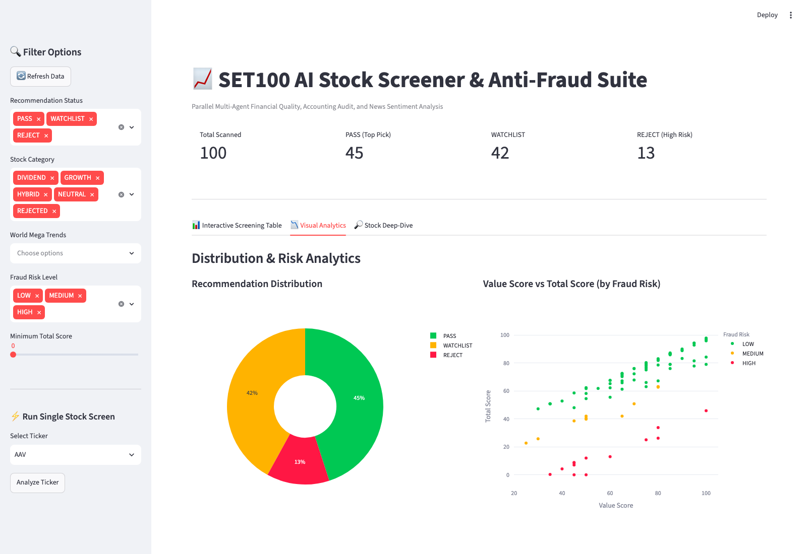
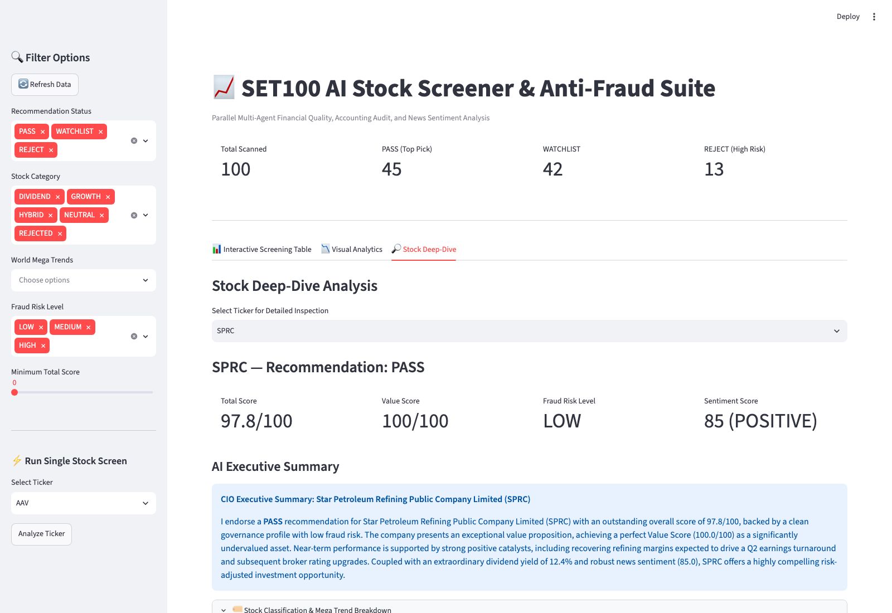

# 📈 SET100 AI Stock Screener & Anti-Fraud Suite

An automated, parallel multi-agent AI financial screening & classification system built with **LangGraph**, **Gemini 3.6 Flash**, and **Streamlit** for Thai SET 100 stocks. 

The system simultaneously evaluates fundamental value metrics, conducts forensic accounting audits (detecting accounting fraud and red flags), analyzes Thai financial news sentiment, classifies stocks into **Dividend vs. Growth** profiles with **World Mega Trend** intelligence, and enforces a mandatory **Safety & Anti-Fraud Override** to protect capital before generating investment recommendations (`PASS`, `WATCHLIST`, `REJECT`).

---

## 🌟 Key Features

- 🛡️ **Safety & Anti-Fraud Override First**: If high accounting risk or cash flow anomalies (e.g. Net Income vs Operating Cash Flow divergence) are detected, the stock is automatically assigned **`REJECT`** and `payout_safety = UNSAFE` regardless of dividend yield or valuation metrics.
- 🏷️ **Dividend vs. Growth Stock Classification**: Automatically categorizes tickers into `DIVIDEND`, `GROWTH`, `HYBRID`, `NEUTRAL`, or `REJECTED` categories based on quantitative performance metrics (Yield, Payout Ratio, 3-Yr Revenue & EPS CAGR) and LLM-synthesized rationales.
- 🌍 **World Mega Trend Intelligence**: Evaluates stock alignment with major global structural trends, including:
  - 🤖 *AI & Data Center Infrastructure*
  - ⚡ *EV & Renewable Energy*
  - 🏥 *Healthcare & Aging Society*
  - 📦 *Digital Commerce & Smart Logistics*
- ⚡ **Parallel Multi-Agent Architecture**: Decoupled single-responsibility nodes managed by a LangGraph Fan-Out / Fan-In graph for fast parallel evaluation.
- 📊 **Value & Profitability Screener**: Evaluates ROE, Free Cash Flow, Current Ratio, D/E Ratio, and valuation metrics (P/E, P/BV).
- 📰 **Thai News Sentiment Agent**: Scrapes recent Thai financial news via Google News RSS (`{ticker} หุ้น`) and scores sentiment (-100 to +100) using Gemini structured output.
- 🔔 **Multi-Channel Push Alerts**: Instant Telegram & LINE push notifications for `PASS` recommendations and daily post-market batch digests.
- 💻 **Interactive Web Dashboard**: Streamlit UI featuring category & Mega Trend filters, sortable color-coded tables, Plotly distribution charts, and stock deep-dive with classification breakdown cards and live 1-year candlestick price charts.
- ⏰ **Automated Post-Market Batch Runs**: APScheduler cron job running daily at **17:00 ICT** (Mon-Fri) exporting Excel (`.xlsx`) and UTF-8-SIG CSV (`.csv`) reports.

---

## 🏗️ Multi-Agent Workflow Architecture



---

## 🔢 Total Score Formula & Decision Rules

$$\text{Total Score} = (\text{Value Score} \times 0.7) + \left(\frac{\text{Sentiment Score} + 100}{2} \times 0.3\right) - \text{Fraud Penalty}$$

- **Fraud Penalty**: `0` for LOW risk, `20` for MEDIUM risk, auto-REJECT for HIGH risk.

### Recommendation Decision Logic
1. **Rule 1 (Safety Override)**: `Fraud Risk == HIGH` $\rightarrow$ **`REJECT`** (overrides all scores and categories).
2. **Rule 2 (Sentiment Override)**: `Sentiment Score < -50` $\rightarrow$ **`WATCHLIST`** or **`REJECT`** (overrides `PASS`).
3. **Rule 3 (PASS Criteria)**: `Fraud Risk == LOW` AND `Value Score >= 70` AND `Sentiment Score >= -20` $\rightarrow$ **`PASS`**.
4. **Rule 4 (Default)**: All other combinations $\rightarrow$ **`WATCHLIST`**.

---

## 🚀 Quick Start

### 1. Prerequisites
- **Python 3.10+**
- Google Gemini API Key (`GOOGLE_API_KEY`)

### 2. Installation
```bash
# Clone the repository
git clone https://github.com/nontster/set-100-screener.git
cd set-100-screener

# Create virtual environment
python3 -m venv .venv
source .venv/bin/activate

# Install dependencies
pip install -r requirements.txt
```

### 3. Environment Configuration
Copy the template environment file and configure your API keys:
```bash
cp .env.example .env
```
Edit `.env`:
```env
GOOGLE_API_KEY=your_gemini_api_key_here
GEMINI_MODEL=gemini-3.6-flash
APP_LANGUAGE=th # Language for Executive Summaries: 'th' (Thai) or 'en' (English, default)
TELEGRAM_BOT_TOKEN=your_telegram_bot_token_here
TELEGRAM_CHAT_ID=your_telegram_chat_id_here
LINE_CHANNEL_ACCESS_TOKEN=your_line_channel_access_token_here
LINE_USER_ID=your_line_user_id_here
```

---

## 💻 Usage Instructions

### 1. Run Single Stock CLI Screen
Evaluate any SET100 stock symbol:
```bash
python -m src.graph --ticker ADVANC [--notify]
```
**Output Example (JSON)**:
```json
{
  "ticker": "ADVANC",
  "recommendation": "PASS",
  "total_score": 82.5,
  "fraud_risk_level": "LOW",
  "value_score": 80,
  "sentiment_score": 50,
  "executive_summary": "Strong market position with robust free cash flows and low accounting risk.",
  "classification_report": {
    "category": "HYBRID",
    "dividend_score": 85,
    "growth_score": 75,
    "payout_safety": "SAFE",
    "mega_trends": ["AI & Data Center Infrastructure"],
    "rationale": "Dual-benefit stock offering both attractive dividend yield (4.8%) and AI Data Center infrastructure expansion."
  }
}
```

### 2. Launch Interactive Web Dashboard
```bash
streamlit run src/app.py
```
Open your browser at `http://localhost:8501`.

---

### 📱 Interactive Dashboard User Guide

The Streamlit web application provides a comprehensive multi-view interface organized into **3 specialized tabs**:

#### 📊 1. Interactive Screening Table
The **Interactive Screening Table** displays all evaluated SET100 stocks in a sortable, filterable table.



**How to Read Results**:
- **Sidebar Filters**: Filter stocks by **Recommendation Status** (`PASS`, `WATCHLIST`, `REJECT`), **Stock Category** (`DIVIDEND`, `GROWTH`, `HYBRID`, `NEUTRAL`), **Payout Safety** (`SAFE`, `CAUTION`, `UNSAFE`), and **World Mega Trends** (`AI & Data Center Infrastructure`, `EV & Renewable Energy`, etc.).
- **Recommendation Badges**:
  - 🟢 **PASS**: High-conviction top pick (`Value Score >= 70`, `Fraud Risk == LOW`, positive news sentiment).
  - 🟡 **WATCHLIST**: Acceptable fundamentals or mild sentiment headwinds; candidate for entry on dips.
  - 🔴 **REJECT**: Auto-triggered by `HIGH` accounting fraud risk or severe negative news sentiment.
- **Total Score Progress Bar**: Calculated composite score from 0.0 to 100.0 incorporating Value Score, Sentiment Score, and Fraud Penalties.
- **Value Score & Fraud Risk Level**: Quick visual check of fundamental valuation and forensic accounting audit status.
- **Executive Summary**: Multilingual AI-generated summary (configured via `APP_LANGUAGE=th` or `en`) with **bold recommendation terms** (`**PASS**`, `**REJECT**`).

---

#### 📉 2. Visual Analytics
The **Visual Analytics** tab translates aggregate screening data into high-level portfolio distribution and risk metrics.



**How to Read Results**:
- **Recommendation Distribution (Donut Chart)**: Visualizes the proportion of screened SET100 stocks categorized into `PASS`, `WATCHLIST`, and `REJECT`.
- **Value Score vs Total Score Scatter Plot**:
  - Plots stock **Value Score** (x-axis) against **Total Score** (y-axis).
  - **Color-Coded by Fraud Risk**: Green dots indicate `LOW` fraud risk, yellow dots indicate `MEDIUM` risk, and red dots mark `HIGH` accounting risk.
  - Outliers in the top-right quadrant with green indicators represent the safest, highest-value investment candidates.

---

#### 🔎 3. Stock Deep-Dive Analysis
The **Stock Deep-Dive** tab allows in-depth forensic inspection of any individual SET100 stock (e.g. `ADVANC`, `WHA`, `CPALL`).



**How to Read Results**:
- **4 Core Metric Cards**:
  1. **Total Score**: Final composite score (out of 100.0).
  2. **Value Score**: Fundamental valuation rating.
  3. **Fraud Risk Level**: Forensic accounting assessment (`LOW`, `MEDIUM`, or `HIGH`).
  4. **Sentiment Score & Orientation**: Numerical score (-100 to +100) and sentiment orientation tag e.g. `55 (POSITIVE)`.
- **AI Executive Summary**: Concise 3–4 sentence Chief Investment Officer report in the configured language (`APP_LANGUAGE=th` for Thai), with highlighted bold decision keywords (`**PASS**`).
- **🏷️ Stock Classification & Mega Trend Breakdown Card**:
  - **Stock Category**: Categorization e.g. `DIVIDEND`, `GROWTH`, or `HYBRID`.
  - **Payout Safety**: Dividend sustainability rating (`SAFE`, `CAUTION`, `UNSAFE`).
  - **World Mega Trend Exposure**: Structural trend tags e.g. `AI & Data Center Infrastructure`.
  - **Classification Rationale**: Localized explanation highlighting dividend yield stability, payout safety, and mega-trend growth drivers.
- **1-Year Price History Chart**: Interactive Plotly candlestick price chart powered by `yfinance` displaying 1-year historical price action (`ADVANC.BK`).

### 3. Run SET100 Batch Screening
Scans all ~100 tickers in parallel and exports reports:
```bash
python -m src.batch --workers 3 --output-dir .
```
Outputs:
- `SET100_AI_Screening_Report.xlsx` (Excel report with Stock Category & Mega Trend columns)
- `SET100_AI_Screening_Report.csv` (UTF-8-SIG encoded CSV for Thai text compatibility)

### 4. Start Post-Market Daily Scheduler
Runs batch screening automatically every weekday at 17:00 ICT:
```bash
python -m src.scheduler
```

---

## 🧪 Testing

Run the complete test suite (31 unit and integration tests):
```bash
PYTHONPATH=. .venv/bin/pytest tests/ -v
```

---

## 🛠️ Tech Stack & Standards

- **Agent Orchestration**: LangGraph, LangChain Google GenAI (`gemini-3.6-flash` with `with_structured_output`)
- **Data Extraction**: `yfinance` (financial metrics & price history), `requests` + `beautifulsoup4` (Google News RSS)
- **Data Schemas**: `pydantic` (v2) models
- **Batch Export**: `pandas`, `openpyxl` (Excel), UTF-8-SIG CSV
- **Scheduling**: `apscheduler` with `pytz` (`Asia/Bangkok` ICT)
- **User Interface**: `streamlit`, `plotly`
- **Notifications**: Telegram Bot API, LINE Messaging API

---

## 📜 License

MIT License. See [LICENSE](LICENSE) for details.
