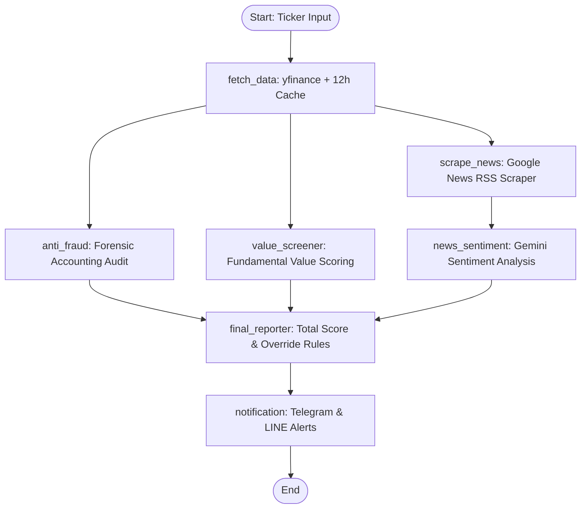

# 📈 SET100 AI Stock Screener & Anti-Fraud Suite

An automated, multi-agent AI financial screening system built with **LangGraph**, **Gemini 2.0 Flash**, and **Streamlit** for Thai SET 100 stocks. 

The system simultaneously evaluates fundamental value metrics, conducts forensic accounting audits (detecting accounting fraud and red flags), analyzes Thai financial news sentiment, and enforces a mandatory **Safety & Anti-Fraud Override** to protect capital before generating investment decisions (`PASS`, `WATCHLIST`, `REJECT`).

---

## 🌟 Key Features

- 🛡️ **Safety & Anti-Fraud Override First**: If high accounting risk or cash flow anomalies (e.g. Net Income vs CFO divergence) are detected, the stock is automatically assigned **`REJECT`** regardless of valuation.
- ⚡ **Parallel Multi-Agent Architecture**: Decoupled single-responsibility nodes managed by a LangGraph Fan-Out / Fan-In graph for fast parallel evaluation.
- 📊 **Value & Profitability Screener**: Evaluates ROE, Free Cash Flow, Current Ratio, D/E Ratio, and valuation metrics (P/E, P/BV).
- 📰 **Thai News Sentiment Agent**: Scrapes recent Thai financial news via Google News RSS (`{ticker} หุ้น`) and scores sentiment (-100 to +100) using Gemini structured output.
- 🔔 **Multi-Channel Push Alerts**: Instant Telegram & LINE push notifications for `PASS` recommendations and daily post-market batch digests.
- 💻 **Interactive Web Dashboard**: Streamlit UI with metric cards, sortable color-coded tables, Plotly distribution charts, and stock deep-dive with live 1-year candlestick price charts.
- ⏰ **Automated Post-Market Batch Runs**: APScheduler cron job running daily at **17:00 ICT** (Mon-Fri) exporting Excel (`.xlsx`) and UTF-8-SIG CSV (`.csv`) reports.

---

## 🏗️ Multi-Agent Workflow Architecture



---

## 🔢 Total Score Formula & Decision Rules

$$\text{Total Score} = (\text{Value Score} \times 0.7) + \left(\frac{\text{Sentiment Score} + 100}{2} \times 0.3\right) - \text{Fraud Penalty}$$

- **Fraud Penalty**: `0` for LOW risk, `20` for MEDIUM risk, auto-REJECT for HIGH risk.

### Recommendation Decision Logic
1. **Rule 1 (Safety Override)**: `Fraud Risk == HIGH` $\rightarrow$ **`REJECT`** (overrides all scores).
2. **Rule 2 (Sentiment Override)**: `Sentiment Score < -50` $\rightarrow$ **`WATCHLIST`** or **`REJECT`** (overrides `PASS`).
3. **Rule 3 (PASS Criteria)**: `Fraud Risk == LOW` AND `Value Score >= 70` AND `Sentiment Score >= -20` $\rightarrow$ **`PASS`**.
4. **Rule 4 (Default)**: All other combinations $\rightarrow$ **`WATCHLIST`**.

---

## 🚀 Quick Start

### 1. Prerequisites
- **Python 3.10+**
- Google Gemini API Key

### 2. Installation
```bash
# Clone the repository
git clone https://github.com/nontster/set-100-screener.git
cd set-100-screener

# Create virtual environment
python3 -m venv .venv
source .venv/bin/activate

# Install dependencies
pip install -r requirements.txt
```

### 3. Environment Configuration
Copy the template environment file and configure your API keys:
```bash
cp .env.example .env
```
Edit `.env`:
```env
GOOGLE_API_KEY=your_gemini_api_key_here
TELEGRAM_BOT_TOKEN=your_telegram_bot_token_here
TELEGRAM_CHAT_ID=your_telegram_chat_id_here
LINE_CHANNEL_ACCESS_TOKEN=your_line_channel_access_token_here
LINE_USER_ID=your_line_user_id_here
```

---

## 💻 Usage Instructions

### 1. Run Single Stock CLI Screen
Evaluate any SET100 stock symbol:
```bash
python -m src.graph --ticker CPALL [--notify]
```
**Output Example (JSON)**:
```json
{
  "ticker": "CPALL",
  "recommendation": "PASS",
  "total_score": 78.5,
  "fraud_risk_level": "LOW",
  "value_score": 80,
  "sentiment_score": 45,
  "executive_summary": "Solid retail business with consistent cash flows and low fraud risk."
}
```

### 2. Launch Interactive Web Dashboard
```bash
streamlit run src/app.py
```
Open your browser at `http://localhost:8501`.

### 3. Run SET100 Batch Screening
Scans all ~100 tickers in parallel and exports reports:
```bash
python -m src.batch --workers 3 --output-dir .
```
Outputs:
- `SET100_AI_Screening_Report.xlsx` (Excel report)
- `SET100_AI_Screening_Report.csv` (UTF-8-SIG encoded CSV for Thai text)

### 4. Start Post-Market Daily Scheduler
Runs batch screening automatically every weekday at 17:00 ICT:
```bash
python -m src.scheduler
```

---

## 🧪 Testing

Run the complete test suite (20 unit and integration tests):
```bash
PYTHONPATH=. pytest tests/ -v
```

---

## 🛠️ Tech Stack & Standards

- **Agent Orchestration**: LangGraph, LangChain Google GenAI (`gemini-2.0-flash` with `with_structured_output`)
- **Data Extraction**: `yfinance` (financial metrics & price history), `requests` + `beautifulsoup4` (Google News RSS)
- **Data Schemas**: `pydantic` (v2) models
- **Batch Export**: `pandas`, `openpyxl` (Excel), UTF-8-SIG CSV
- **Scheduling**: `apscheduler` with `pytz` (`Asia/Bangkok` ICT)
- **User Interface**: `streamlit`, `plotly`
- **Notifications**: Telegram Bot API, LINE Messaging API

---

## 📜 License

MIT License. See [LICENSE](LICENSE) for details.
