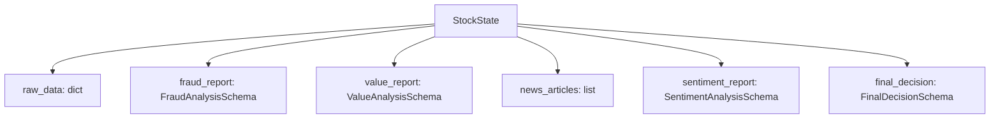
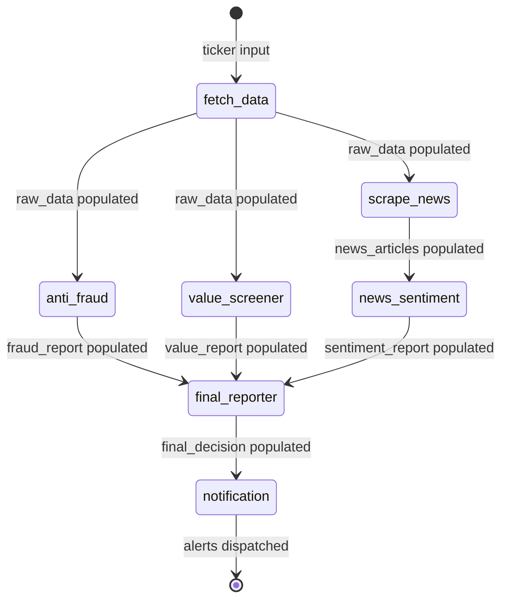

# Data Model: SET100 AI Stock Screener & Anti-Fraud Suite

**Date**: 2026-07-25 | **Plan**: [plan.md](./plan.md)

## Entity Relationship Overview



## Entities

### StockState (TypedDict)

Unified LangGraph workflow state passed between all nodes.

| Field | Type | Description | Source |
|-------|------|-------------|--------|
| `ticker` | `str` | Stock symbol without suffix (e.g., "CPALL") | User input |
| `raw_data` | `Dict[str, Any]` | Extracted financial metrics from yfinance | `fetch_data_node` |
| `fraud_report` | `Optional[Dict[str, Any]]` | Anti-fraud evaluation output | `anti_fraud_node` |
| `value_report` | `Optional[Dict[str, Any]]` | Value screening output | `value_screener_node` |
| `news_articles` | `Optional[List[Dict[str, str]]]` | Scraped Thai news items | `scrape_news_node` |
| `sentiment_report` | `Optional[Dict[str, Any]]` | News sentiment analysis output | `news_sentiment_node` |
| `final_decision` | `Optional[Dict[str, Any]]` | Final recommendation and score | `final_reporter_node` |
| `error` | `Optional[str]` | Error message if any node fails | Any node |

---

### raw_data Dictionary Structure

Extracted from `yfinance.Ticker("{ticker}.BK")`.

| Field | Type | Source | Fallback |
|-------|------|--------|----------|
| `pe_ratio` | `Optional[float]` | `info["trailingPE"]` | `N/A` |
| `pb_ratio` | `Optional[float]` | `info["priceToBook"]` | `N/A` |
| `roe` | `Optional[float]` | `info["returnOnEquity"]` × 100 | `N/A` |
| `de_ratio` | `Optional[float]` | `info["debtToEquity"]` / 100 | `N/A` |
| `dividend_yield` | `Optional[float]` | `info["dividendYield"]` × 100 | `N/A` |
| `current_ratio` | `Optional[float]` | `info["currentRatio"]` | `N/A` |
| `free_cash_flow` | `Optional[float]` | `cashflow["Free Cash Flow"]` | `N/A` |
| `operating_cash_flow` | `Optional[float]` | `cashflow["Operating Cash Flow"]` | `N/A` |
| `net_income` | `Optional[float]` | `financials["Net Income"]` | `N/A` |

---

### FraudAnalysisSchema (Pydantic v2 BaseModel)

Structured output from Gemini via `with_structured_output`.

| Field | Type | Constraints | Description |
|-------|------|-------------|-------------|
| `fraud_risk_level` | `Literal["LOW", "MEDIUM", "HIGH"]` | Enum: LOW, MEDIUM, HIGH | Overall accounting risk assessment |
| `cash_flow_quality` | `str` | Free text | Assessment of CFO vs Net Income alignment |
| `red_flags` | `List[str]` | List of strings | Specific accounting red flags detected |
| `reasoning` | `str` | Free text | Detailed reasoning for risk assessment |

**Validation Rules**:
- If `fraud_risk_level == "HIGH"` → final recommendation MUST be `REJECT` (enforced in `final_reporter`).
- If Net Income > 0 but Operating Cash Flow < 0 → strong red flag indicator.

---

### ValueAnalysisSchema (Pydantic v2 BaseModel)

| Field | Type | Constraints | Description |
|-------|------|-------------|-------------|
| `is_value_stock` | `bool` | Boolean | Whether stock meets value criteria |
| `score` | `int` | `Field(ge=0, le=100)` | Value quality score (0-100) |
| `valuation_status` | `Literal["UNDERVALUED", "FAIRLY_VALUED", "OVERVALUED"]` | Enum | Current valuation assessment |
| `key_strengths` | `List[str]` | List of strings | Positive financial indicators |
| `key_weaknesses` | `List[str]` | List of strings | Negative financial indicators |

**Scoring Guidelines** (provided to Gemini in prompt):
- ROE > 15% → strong positive signal
- P/E below sector median → value indicator
- Positive Free Cash Flow → financial health
- D/E < 1.0 → conservative leverage

---

### SentimentAnalysisSchema (Pydantic v2 BaseModel)

| Field | Type | Constraints | Description |
|-------|------|-------------|-------------|
| `overall_sentiment` | `Literal["POSITIVE", "NEUTRAL", "NEGATIVE"]` | Enum | Aggregate sentiment label |
| `sentiment_score` | `int` | `Field(ge=-100, le=100)` | Numerical sentiment (-100 to +100) |
| `key_catalysts` | `List[str]` | List of strings | Positive news drivers |
| `key_risks` | `List[str]` | List of strings | Negative news drivers |
| `news_summary` | `str` | Free text | Brief summary of analyzed articles |

**Edge Case Rules**:
- If zero news articles found → `sentiment_score = 0`, `overall_sentiment = "NEUTRAL"`.
- Score < -50 → triggers override in `final_reporter` (PASS → WATCHLIST/REJECT).

---

### FinalDecisionSchema (Pydantic v2 BaseModel)

| Field | Type | Constraints | Description |
|-------|------|-------------|-------------|
| `recommendation` | `Literal["PASS", "WATCHLIST", "REJECT"]` | Enum | Final investment recommendation |
| `total_score` | `float` | `Field(ge=0, le=100)` | Composite score |
| `executive_summary` | `str` | Free text | AI-generated summary of analysis |

**Total Score Formula**:
```
total_score = (value_score * 0.7) + (((sentiment_score + 100) / 2) * 0.3) - fraud_penalty
```
Where `fraud_penalty`: LOW = 0, MEDIUM = 20, HIGH = auto-REJECT.

**Decision Logic** (enforced in `final_reporter`, NOT by LLM):
1. `fraud_risk_level == "HIGH"` → `REJECT` (overrides everything)
2. `sentiment_score < -50` → `WATCHLIST` or `REJECT` (overrides PASS)
3. `fraud_risk_level == "LOW"` AND `value_score >= 70` AND `sentiment_score >= -20` → `PASS`
4. All other combinations → `WATCHLIST`

---

## State Transitions


