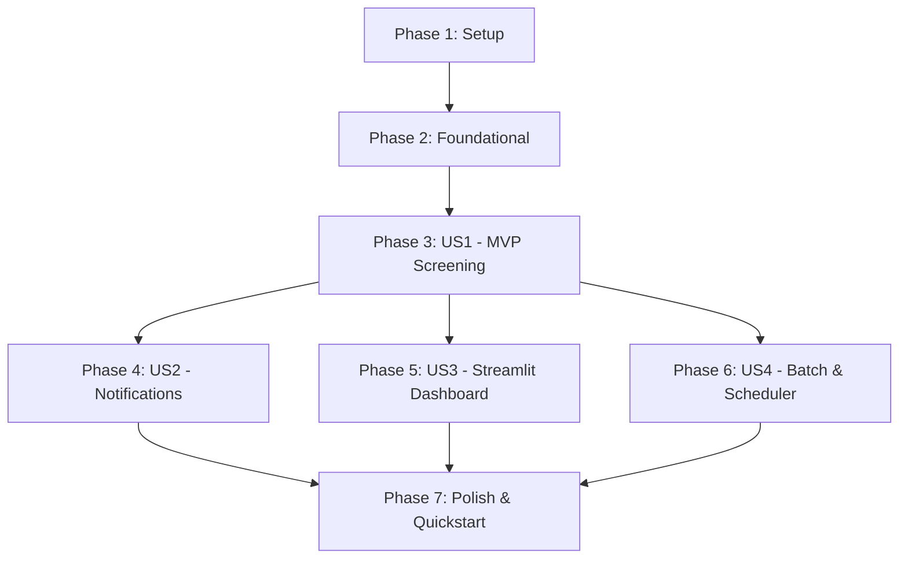

# Tasks: SET100 AI Stock Screener & Anti-Fraud Suite

**Input**: Design documents from `/specs/001-set100-stock-screener/`  
**Prerequisites**: plan.md (required), spec.md (required), research.md, data-model.md, contracts/

## Format: `[ID] [P?] [Story?] Description with file path`

- **[P]**: Can run in parallel (different files, no dependencies)
- **[Story]**: Which user story this task belongs to (e.g., US1, US2, US3, US4)

---

## Phase 1: Setup (Shared Infrastructure)

**Purpose**: Project initialization and basic directory structure

- [x] T001 Create project directory structure (`src/`, `src/nodes/`, `tests/unit/`, `tests/integration/`, `.cache/`) per implementation plan
- [x] T002 Initialize `requirements.txt` with dependencies (`langgraph`, `langchain-google-genai`, `yfinance`, `requests`, `beautifulsoup4`, `pydantic`, `pandas`, `openpyxl`, `apscheduler`, `pytz`, `streamlit`, `plotly`, `python-dotenv`, `tqdm`, `pytest`)
- [x] T003 [P] Create environment variable template in `.env.example` (`GOOGLE_API_KEY`, `TELEGRAM_BOT_TOKEN`, `TELEGRAM_CHAT_ID`, `LINE_CHANNEL_ACCESS_TOKEN`, `LINE_USER_ID`)

---

## Phase 2: Foundational (Blocking Prerequisites)

**Purpose**: Core infrastructure, data schemas, and state definitions required before any user story can execute

- [x] T004 Implement environment configuration loader in `src/config.py` using `python-dotenv`
- [x] T005 [P] Create Pydantic v2 output schemas (`FraudAnalysisSchema`, `ValueAnalysisSchema`, `SentimentAnalysisSchema`, `FinalDecisionSchema`) in `src/schemas.py`
- [x] T006 [P] Define unified workflow state `StockState` TypedDict in `src/state.py`
- [x] T007 [P] Define SET100 ticker list constant in `src/set100_tickers.py`
- [x] T008 [P] Implement 12-hour TTL file-based JSON caching helper in `src/cache.py`
- [x] T009 [P] Implement unit tests for schemas and validation constraints in `tests/unit/test_schemas.py`
- [x] T010 [P] Implement unit tests for 12-hour TTL caching mechanism in `tests/unit/test_cache.py`

**Checkpoint**: Foundation ready - core data schemas, state definitions, and caching helper in place.

---

## Phase 3: User Story 1 - Automated SET100 Stock Screening & Anti-Fraud Override (Priority: P1) 🎯 MVP

**Goal**: Implement the core LangGraph fan-out/fan-in parallel workflow that evaluates SET100 tickers across Anti-Fraud, Value, and News Sentiment nodes, enforcing mandatory REJECT overrides for high-risk stocks.

**Independent Test**: Execute `python -m src.graph --ticker CPALL` and verify financial metric extraction, parallel evaluation output, Total Score calculation, and Anti-Fraud REJECT override enforcement.

- [x] T011 [US1] Implement `fetch_data_node` entry node with `.BK` ticker suffix mapping and cache lookup in `src/nodes/fetch_data.py`
- [x] T012 [P] [US1] Implement `anti_fraud_node` (Branch A) for accounting risk audit using Gemini structured output in `src/nodes/anti_fraud.py`
- [x] T013 [P] [US1] Implement `value_screener_node` (Branch B) for value & profitability scoring in `src/nodes/value_screener.py`
- [x] T014 [P] [US1] Implement `scrape_news_node` (Branch C1) for Google News RSS scraping in `src/nodes/scrape_news.py`
- [x] T015 [US1] Implement `news_sentiment_node` (Branch C2) for news sentiment analysis using Gemini structured output in `src/nodes/news_sentiment.py` (depends on T014)
- [x] T016 [US1] Implement `final_reporter_node` fan-in join node with Total Score math formula and Anti-Fraud REJECT override logic in `src/nodes/final_reporter.py`
- [x] T017 [US1] Assemble LangGraph parallel workflow graph and CLI single-stock interface in `src/graph.py`
- [x] T018 [P] [US1] Write unit tests for Total Score calculation formula and penalty rules in `tests/unit/test_scoring.py`
- [x] T019 [P] [US1] Write unit tests for Anti-Fraud override decision logic in `tests/unit/test_decision_logic.py`
- [x] T020 [US1] Write integration test for full LangGraph workflow execution in `tests/integration/test_graph_flow.py`

**Checkpoint**: User Story 1 (MVP) fully functional and testable independently via CLI (`src.graph`).

---

## Phase 4: User Story 2 - Multi-Channel Alerts & Batch Digest (Priority: P2)

**Goal**: Deliver formatted push notifications via Telegram Bot API and LINE Messaging API for single-stock `PASS` results and consolidated batch screening digests.

**Independent Test**: Execute `python -m src.graph --ticker CPALL --notify` and verify receipt of Telegram and LINE alert messages.

- [x] T021 [US2] Implement Telegram and LINE notification dispatch function in `src/nodes/notification.py`
- [x] T022 [US2] Add single-stock alert dispatch step to `src/nodes/notification.py` for manual single-ticker `PASS` recommendations
- [x] T023 [US2] Add consolidated Batch Digest dispatch formatting for Telegram and LINE in `src/nodes/notification.py`
- [x] T024 [P] [US2] Connect notification node to LangGraph workflow in `src/graph.py`

**Checkpoint**: User Stories 1 AND 2 working independently. PASS recommendations automatically trigger Telegram/LINE alerts.

---

## Phase 5: User Story 3 - Interactive Web Dashboard & Stock Deep-Dive (Priority: P3)

**Goal**: Build an interactive Streamlit dashboard featuring filter controls, summary metric cards, sortable color-coded tables, Plotly distribution/scatter charts, and a stock deep-dive page with 1-year candlestick price charts.

**Independent Test**: Run `streamlit run src/app.py`, test sidebar filters, verify chart rendering, and select a stock for deep-dive inspection.

- [x] T025 [US3] Build Streamlit dashboard sidebar with filter controls, score slider, and cache clear button in `src/app.py`
- [x] T026 [US3] Build Top Summary Row metric cards (Total Scanned, PASS, WATCHLIST, REJECT) in `src/app.py`
- [x] T027 [US3] Build Tab 1: Interactive Screening Table with color-coded status badges and score progress bars in `src/app.py`
- [x] T028 [US3] Build Tab 2: Visual Analytics (Plotly Recommendation Pie Chart & Value Score vs Total Score Scatter Plot) in `src/app.py`
- [x] T029 [US3] Build Tab 3: Stock Deep-Dive with stock selector, AI executive summary, red flags, and Plotly 1-year candlestick price chart in `src/app.py`

**Checkpoint**: User Stories 1, 2, and 3 fully interactive. Full web dashboard functional.

---

## Phase 6: User Story 4 - Automated Post-Market Daily Batch Processing & Export (Priority: P4)

**Goal**: Implement multi-threaded batch processing for all SET100 tickers, export formatted Excel and UTF-8-SIG CSV reports, and schedule automated 17:00 ICT daily post-market runs.

**Independent Test**: Execute `python -m src.batch`, verify progress bar, confirm generated `SET100_AI_Screening_Report.xlsx` and `SET100_AI_Screening_Report.csv` files, and test `python -m src.scheduler`.

- [x] T030 [US4] Implement SET100 multi-threaded batch processing runner with `ThreadPoolExecutor` and `tqdm` progress tracking in `src/batch.py`
- [x] T031 [US4] Implement Excel (`SET100_AI_Screening_Report.xlsx`) and UTF-8-SIG CSV (`SET100_AI_Screening_Report.csv`) report exporter in `src/batch.py`
- [x] T032 [US4] Implement APScheduler `BlockingScheduler` daily cron job at 17:00 ICT (Mon-Fri) in `src/scheduler.py`
- [x] T033 [P] [US4] Write integration tests for multi-threaded batch execution and report generation in `tests/integration/test_batch_pipeline.py`

**Checkpoint**: All user stories complete. Automated daily batch screening and report generation active.

---

## Phase 7: Polish & Cross-Cutting Concerns

**Purpose**: Final code cleanup, type hinting verification, error log hardening, and validation.

- [x] T034 Add comprehensive docstrings, type hinting, and error handling logs across all graph nodes in `src/nodes/`
- [x] T035 [P] Validate quickstart validation scenarios end-to-end per `specs/001-set100-stock-screener/quickstart.md`

---

## Dependencies & Execution Order

### Parallel Execution Opportunities

- **Foundational (Phase 2)**: T005, T006, T007, T008, T009, T010 can execute concurrently.
- **US1 Parallel Nodes (Phase 3)**: T012 (`anti_fraud_node`), T013 (`value_screener_node`), T014 (`scrape_news_node`) can be implemented in parallel.
- **Post-MVP Phases (Phases 4, 5, 6)**: US2 (Notifications), US3 (Dashboard), and US4 (Batch/Scheduler) can proceed in parallel once US1 MVP is complete.

---

## Implementation Strategy

### MVP First (User Story 1 Only)
1. Complete Phase 1 (Setup) and Phase 2 (Foundational).
2. Complete Phase 3 (US1 Core Screening Engine).
3. **STOP and VALIDATE**: Run `python -m src.graph --ticker CPALL` to confirm single-stock screening and Anti-Fraud REJECT overrides.

### Incremental Delivery
1. Add Phase 4 (US2 Notifications) → Validate Telegram/LINE alerts.
2. Add Phase 5 (US3 Dashboard) → Launch Streamlit UI.
3. Add Phase 6 (US4 Batch Processing) → Execute daily 17:00 ICT scheduled scans.
